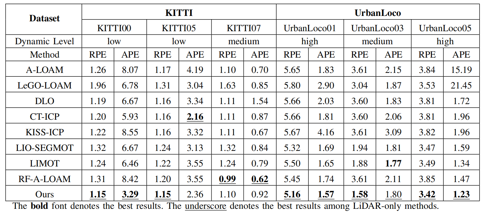
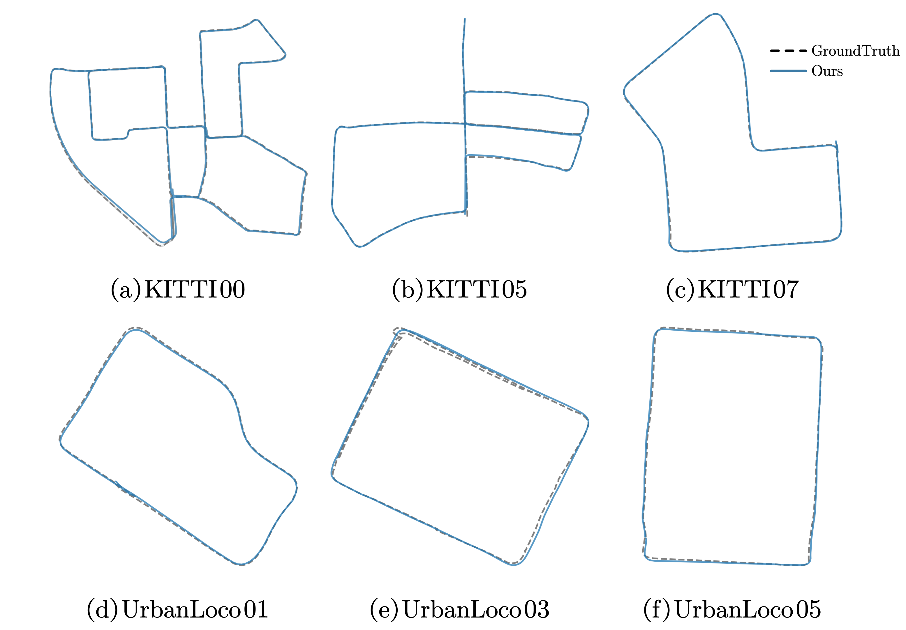

# TRLO: An Efficient LiDAR Odometry with 3D Dynamic Object Tracking and Removal

The official implementation of TRLO (An Efficient LiDAR Odometry with 3D Dynamic Object Tracking and Removal), an accurate LiDAR odometry approach targeted for dynamic environments. TRLO can provide continuous object tracking and accurate localization results while preserving the keyframe selection mechanism in the odometry system. This work is submitted for IEEE T-IM.

<div align=center>

</div>

If you think our work useful for your research, please cite:

## :gear: Installation

### Dependence

Our system has been tested extensively on Ubuntu 20.04 Focal with ROS Noetic, although other versions may work. The following configuration with required dependencies has been verified to be compatible:

- Ubuntu 20.04
- ROS Noetic (roscpp, std_msgs, sensor_msgs, geometry_msgs, pcl_ros, jsk_recognition_msgs)
- C++ 14
- CMake >= 3.22.3
- OpenMP >= 4.5
- Point Cloud Library >= 1.10.0
- Eigen >= 3.3.7
- Cuda 11.3
- cudnn-8.2.1
- TensorRT 8.5.3.1

Installing the binaries from Aptitude should work though:

```
sudo apt install libomp-dev libpcl-dev libeigen3-dev 
```

You should replace the path in line 61 of ‘CMakeList.txt’ with your TensorRT-8.5.3.1 installation path, such as:

```
set(TENSORRT_ROOT /home/jyp/3rdparty/TensorRT-8.5.3.1)
```

### Building

You can use the following command to build the project:

```bash
#!/bin/bash
source "/opt/ros/${ROS_DISTRO}/setup.bash"
mkdir -p ~/catkin_ws/src
cd ~/catkin_ws/src
git clone git@github.com:Yaepiii/TRLO.git
cd ..
catkin_make
```

## :running: Run

According to the dataset you want to test, you can modify the parameter values of 'pointcloud_topic' and 'imu_topic' in trlo.launch. If an IMU is not being used, set the trlo/imu ROS param to false in cfg/trlo.yaml. However, if IMU data is available, please allow TRLO to calibrate and gravity align for three seconds before moving. Note that the current implementation assumes that LiDAR and IMU coordinate frames coincide, so please make sure that the sensors are physically mounted near each other.

After sourcing the workspace, launch the TRLO ROS nodes via:

```bash
#!/bin/bash
# run TRLO node
roslaunch trlo trlo.launch

# play your bag
rosbag play your_test.bag
```

## :clipboard: Evaluation

### Services

To save TRLO's generated map into .pcd format, call the following service:

```bash
rosservice call /robot/trlo_map/save_pcd LEAF_SIZE SAVE_PATH
```

To save the trajectory in KITTI format, call the following service:

```bash
rosservice call /robot/dlo_odom/save_traj SAVE_PAT
```

### Results






For more results, please refer to our [paper]()

## :rose: Acknowledgements

We thank the authors of the [DLO](https://github.com/vectr-ucla/direct_lidar_odometry) and [CenterPoint](https://github.com/tianweiy/CenterPoint) open-source packages:

- K. Chen, B. T. Lopez, A. -a. Agha-mohammadi and A. Mehta, "Direct LiDAR Odometry: Fast Localization With Dense Point Clouds," in IEEE Robotics and Automation Letters, vol. 7, no. 2, pp. 2000-2007, April 2022

- Yin, Tianwei et al. “Center-based 3D Object Detection and Tracking.” 2021 IEEE/CVF Conference on Computer Vision and Pattern Recognition (CVPR) (2020): 11779-11788.


# Website License
<a rel="license" href="http://creativecommons.org/licenses/by-sa/4.0/"></a><br />This work is licensed under a <a rel="license" href="http://creativecommons.org/licenses/by-sa/4.0/">Creative Commons Attribution-ShareAlike 4.0 International License</a>.
